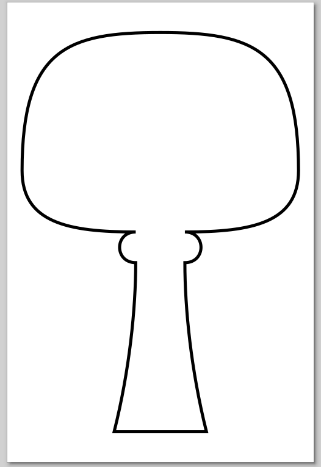
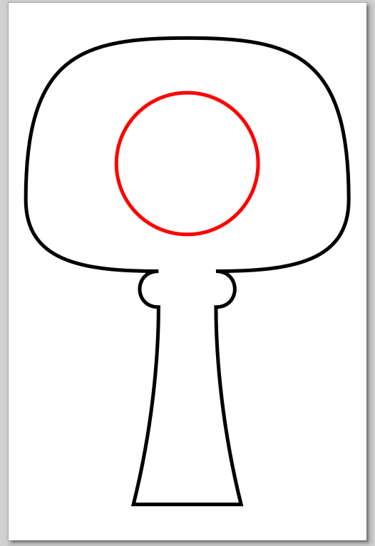
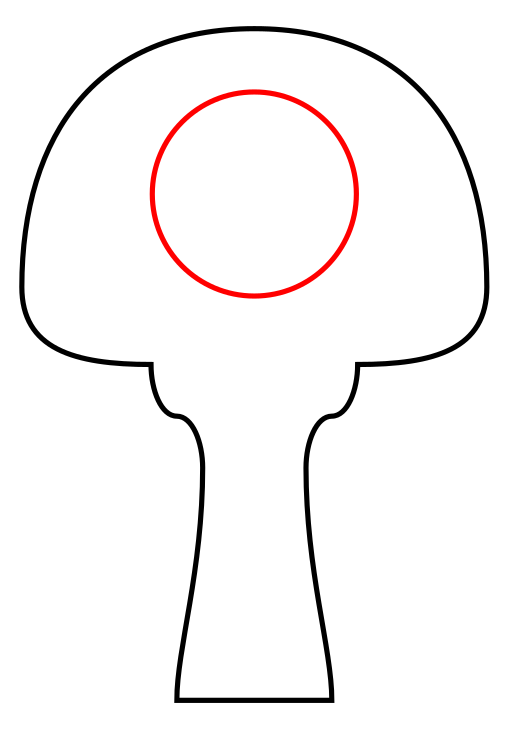
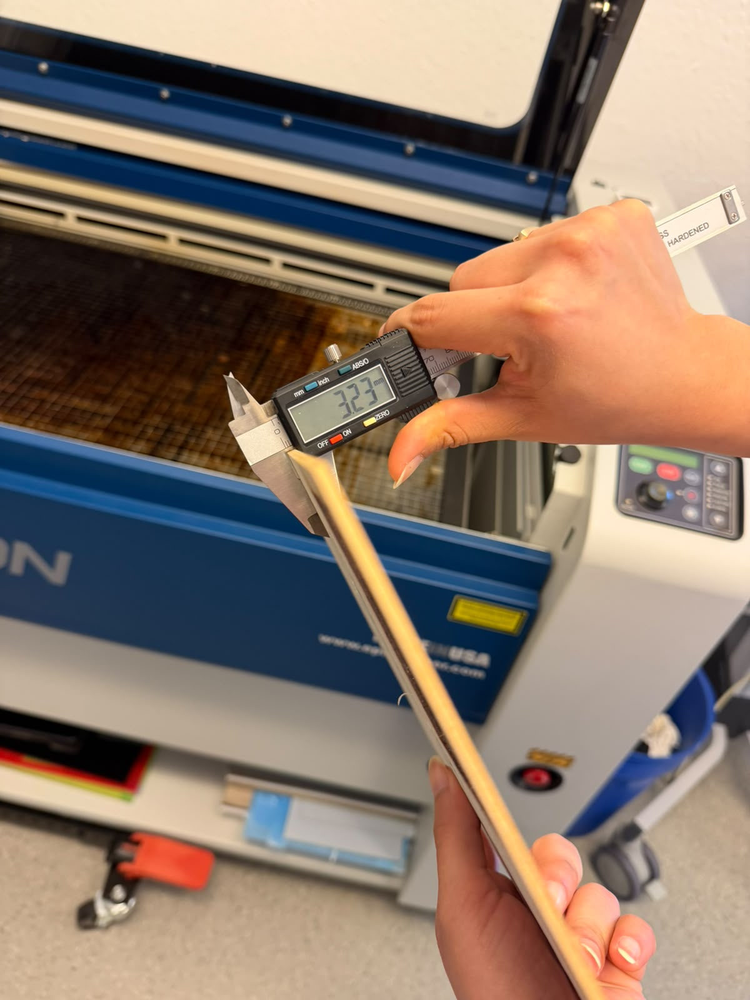
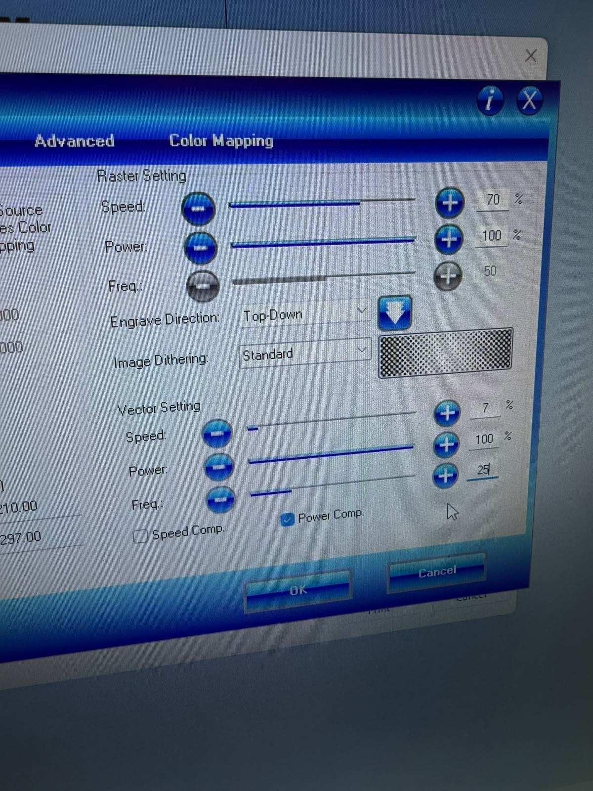

# Digital Design and Fabrication (inf175) - Portfolio

**Student Name:** Maik Bernert  
**Email:** Maik.bernert@uni-oldenburg.de 

## Portfolio Overview

This repository documents my progress, hands-on work, and learning process across 8 interactive exercises in the Digital Design and Fabrication (inf175) module at the University of Oldenburg. 

---

## 1. Electrical Circuits

### Goal
To build and test different manifestations of an LED control circuit, consecutively adding control functionality (simple circuit, switchable, dimmable) while observing and measuring voltages and currents to understand electrical characteristics.

### Process & Materials
*   **Materials Used:** Breadboard, Green LED, Resistors (100 Ω, 220 Ω, 1.0 kΩ, 4.7 kΩ), 1 kΩ potentiometer, 2-position switch, male-male jumper wires, laboratory power supply, multimeter.
*   **Process:** 

    **Task 1.1 - Simple LED Circuit:**
    Constructed a basic LED circuit with a 5V supply. I measured the voltage across the resistor (V1) and the LED (VLED) for different resistor values.
    
    | R1 [Ω] | Measured V1 [V] | Measured VLED [V] |
    |--------|-----------------|-------------------|
    | 220    | 2.0             | 2.8               |
    | 1000   | 2.5             | 2.49              |
    | 4700   | 2.7             | 2.31              |
    
    *Observation:* As the resistance of R1 increases, the voltage drop across the resistor ($V_1$) increases, while the voltage available to the LED ($V_{LED}$) and the current ($I_1$) decrease. This results in a visible decrease in the LED's brightness. The sum of $V_1$ and $V_{LED}$ consistently approximates the 5V supply voltage.

    **Task 1.2 - Switchable LED Circuit:**
    Added a 2-position switch to the circuit.
    
    *Observation:* The switch is a non-directional (non-polar) component; the circuit functions identically regardless of which direction the switch is connected. In contrast, the LED is directional (polar). Connecting the LED in the opposite direction (backwards) prevents it from lighting up because it only allows current to flow in one direction.

    **Task 1.3 - Dimmable LED Circuit:**
    Introduced a 1 kΩ potentiometer to control the LED's brightness.

    | Position            | VLED [V] | V2 (Potentiometer) [V] |
    |---------------------|----------|------------------------|
    | a) full brightness  | 3        | 3                |
    | b) dimmed           | 2.29  | 2.29                |
    | c) OFF              | 1.9  | 1.97                |
    | c) Complete off     | 0.3  | 0.4                |
    
    *Observation:* By rotating the potentiometer, we changed the resistance in the circuit, which redistributed the voltage drop. As $V_2$ (the voltage across the potentiometer) increases, $V_{LED}$ decreases. We observed that the LED does not dim linearly to zero; once $V_{LED}$ falls below a certain "threshold voltage" (approx. 1.9V for this green LED), the LED turns off completely because there is insufficient energy to overcome the semiconductor gap.  

### Visual Documentation

#### Task 1.1: Simple LED Circuit Setup


#### Task 1.3: Dimmable LED Circuit - Potentiometer Control


#### Task 1.3: Measure Values - Potentiometer Control


#### Task 1.3: Video - Potentiometer Brightness Adjustment
[View video: Potentiometer Adjustment](images/exercise_01/Task1.3Video.mp4)

### The 'Failure Log'
*   **What went wrong:** LED connected backwards on the first attempt - it didn't light up.
*   **How I managed it:** Checked LED polarity with the multimeter and reversed the connections.
*   **What I learned:** Always check component polarity before powering circuits, especially with LEDs. The longer leg is the positive terminal.

### Reflection
Adding the switch and potentiometer dramatically improved user control. The switch provides a simple on/off mechanism, while the potentiometer enables continuous brightness adjustment, making the circuit interactive and responsive to user input.

---

## 2. Transistor Switch Circuit

### Goal
To understand and implement transistor switching and PWM (Pulse Width Modulation) control. Through hands-on work, explore how duty cycle affects perceived brightness and how frequency determines whether the LED strip appears to flicker or glow steadily.

### Process & Materials
*   **Materials Used:** Breadboard, NPN MOSFET IRLZ44N transistor, 12V LED Strip, Resistors (100 Ω, 10 kΩ), PWM Signal Generator, Power-supply USB module, 2-position switch, male-male and male-female jumper wires.
*   **Process:** 

    **Task 2.1 - Switchable LED Strip:**
    Constructed a circuit using an NPN MOSFET transistor to switch a 12V LED strip on/off using a 5V control signal. The transistor acts as a digital switch controlled by the gate voltage (VGS). A 10 kΩ pull-down resistor (Rpull) ensures the gate remains low when the switch is open, preventing floating state issues.
    
    *Observation:* The switch successfully controls the LED strip through the transistor. The transistor acts as a voltage-controlled switch, when VGS is high (5V), the transistor conducts and the LED strip lights up. When VGS is low (0V), the transistor blocks current and the LED strip turns off. The 100 Ω gate resistor (Rg) limits the gate current, protecting the transistor. Two separate power supplies (5V for control, 12V for load) with a common ground allow efficient control of high-power loads.

    **Task 2.2 - Dimmable LED Strip (PWM Control):**
    Replaced the simple switch with a PWM signal generator operating at 90 Hz frequency. Explored how duty cycle and frequency affect the LED strip's perceived brightness.

    **Part A: Duty Cycle Variation (f = 90 Hz)**
    
    | Duty Cycle (D) | Observation | Perceived Brightness |
    |---|---|---|
    | 2% | Very brief pulses | Extremely dim, barely visible |
    | 15% | Short pulses | Very dim |
    | 40% | Moderate pulses | Medium brightness |
    | 75% | Long pulses | Very bright |
    | 100% | Continuous conduction | Full brightness |
    
    *Observation:* The perceived brightness of the LED strip is directly proportional to the duty cycle at a fixed frequency. By varying the duty cycle from 2% to 100%, we can smoothly dim the LED strip from nearly off to full brightness. This works because the LED's persistence allows the human eye to perceive the average brightness rather than the individual on/off pulses.

    **Part B: Frequency Variation (D = 50%)**
    
    | Frequency (f) | Observation |
    |---|---|
    | 5 Hz | Visible flicker, distinct on/off pulses |
    | 25 Hz | Reduced flicker, slight visibility of pulsing |
    | 45 Hz | Minimal flicker, mostly steady appearance |
    | 100 Hz | No visible flicker, appears as steady light |
    
    *Observation:* At low frequencies (5 Hz), individual on/off pulses are easily visible and the LED strip appears to flicker. As frequency increases, the flicker becomes less noticeable. Above approximately 45 Hz, the human eye can no longer distinguish individual pulses due to the eye's integration time (typically 20-30 Hz fusion frequency), and the LED strip appears as a steady, continuous light at the average brightness level. This is the principle behind PWM dimming in lighting applications.

### Visual Documentation

#### Task 2.1: Transistor Switch Circuit with 12V LED Strip


#### Task 2.2: PWM Control at 90 Hz - Duty Cycle Variation


#### Task 2.2: Frequency Variation Test - Low Light Conditions


#### Task 2.2: Video - PWM Frequency and Duty Cycle Adjustment
[View video: PWM Control Demonstration](images/exercise_01/Task2.2.mp4)

### The 'Failure Log'
*   **What went wrong:** Initially forgot to connect the common ground between the 5V and 12V supplies.
*   **How I managed it:** Checked all ground connections with the multimeter and ensured a single common ground point.
*   **What I learned:** The pull-down resistor is essential to prevent the gate from floating, and a shared ground is critical for proper circuit operation.

### Reflection
PWM control is superior to simple on/off switching because it allows smooth brightness adjustment without wasting energy as heat. By varying duty cycle, we achieve dimming by controlling the average power. For practical applications like LED lighting systems, PWM is ideal because it's efficient, provides smooth brightness control, and can operate at frequencies above the human perception threshold to eliminate visible flicker.

### References
*   [Digital Design & Fabrication | Exercise 1 Lab Manual]

---

## 3. Microcontroller Basics: Building an Alarm Clock (Exercise 2)

### Goal
To build a fully functional digital alarm clock using an Arduino microcontroller, integrating various components step-by-step. The final setup includes an active buzzer, an I2C LCD display, a Real-Time Clock (RTC) module, push buttons for user input, and an ultrasonic distance sensor to track waving gestures for snooze and stop commands.

### Process & Materials
*   **Materials Used:** Arduino UNO, Breadboard, Active Buzzer, I2C LCD Display (16x2), DS1307 RTC Module, 4 Push Buttons, URM37 Ultrasonic Sensor, Jumper wires, USB cable.
*   **Process:** 

    1. **Sub-circuit 1: Connecting the Buzzer**
       * We connected the buzzer to the Arduino to create simple audible alerts. We ran into a Linux permission problem (`sudo chmod 666 /dev/ttyACM0`) initially when trying to interact with the port. 
       * Without proper resistance or delays, it made a very loud continuous beeping. We initially forgot to connect `VIN` and had a library commented out. We adjusted the source code to assign the buzzer to Pin 12 to test its functionality.

    2. **Sub-circuit 2: Adding the LCD Display**
       * We integrated an I2C 16x2 LCD display. First, we had to find the correct I2C hardware address for the display by running an I2C scanner sketch, which identified our display at address `0x27`.
       * Initially, nothing was displayed on the screen; the output only appeared in the IDE's Serial Monitor.
       * We discovered we needed to install specific libraries to make it function properly, namely `LiquidCrystal_I2C` for the display control and `Adafruit BusIO` for the underlying I2C abstraction. Once the address and libraries were properly set up, we could successfully print text strings to the LCD.

    3. **Sub-circuit 3: Integrating the Real-Time Clock (RTC)**
       * We added a DS1307 RTC module to maintain accurate time independent of the Arduino's power cycle. Because the RTC also uses I2C communication, it seamlessly shares the SDA and SCL lines with the LCD display via the breadboard. We included the `RTClib.h` library to read and process the time easily.
       * The module is powered by a coin cell battery. During our first setup, we uploaded the script to sync the module with the computer's real-time. Thanks to the battery backup, when re-powering or uploading subsequent iterations of the program, the current time was saved and accurately maintained automatically.

    4. **Sub-circuit 4: Using Push Buttons**
       * We integrated push buttons to act as our menu and control inputs. To handle the inputs cleanly and avoid hardware bouncing issues (where a physical press registers as multiple messy digital signals), we utilized the `<Button.h>` library for automatic software debouncing.
       * As an isolated trial test, we wired a single button and programmed a feedback loop: pressing the button successfully triggered the Arduino's built-in "L" LED (Pin 13) to light up. This confirmed our pin definitions and physical breadboard connections were completely functional before we linked them to the complex alarm menu system.

    5. **Final Project: The Complete Alarm Clock**
       * We combined everything into one main circuit utilizing the following button mapped logic:
         * **White Button** (Pin 3): Alarm On/Off Toggle
         * **Red Button** (Pin 2): Menu Toggle (Switching between Main Clock, Set Time, and Set Melody pages)
         * **Yellow Button** (Pin 4): Set Hour / Preview Melody / STOP Alarm
         * **Black Button** (Pin 5): Set Minute / Cycle Melodies / SNOOZE Alarm
       * **How it works:** The system operates using a state machine driven by menus. By default, it shows the current time provided by the RTC module. Pressing the Red button cycles through setting the alarm time and selecting between different melodies (e.g., Classic, Digital, Arpeggio), which can be previewed directly before saving.
       * When the target alarm time is reached, the buzzer starts playing the chosen melody. To interact with the ringing alarm conveniently without having to aim for a small push button, we integrated an ultrasonic sensor (Pins 9 and 10) pointing upwards.
       * We integrated distance logic for touchless control: the sensor measures the distance continuously (normally resting at around ~34 cm facing the ceiling). If a hand waves close to the sensor (dropping the distance reading to 2-5 cm), it triggers a state change to silently stop or snooze the alarm smoothly.

### Code Snippets & Test Scripts

During the development process, isolated test scripts were created to verify individual hardware components before merging them into the complex final alarm clock software:

*   **[Hardware Integration Test](Exercise/exercise_02/button_test.ino):** A simple script we wrote to verify the LCD screen, internal pull-up buttons, and buzzer connectivity simultaneously. It prints real-time button statuses to the LCD and triggers a quick beep when pressed.
*   **[Ultrasonic Sensor Test](Exercise/exercise_02/ultrasonic_test.ino):** A standalone script created because the waving functionality initially failed due to pulse logic. It triggers the URM37 sensor, outputs distance measurements to the Serial Monitor, and successfully turns on the onboard LED (Pin 13) when an object (e.g., a hand) is within 20 cm.

**Final Alarm Clock Highlights: Distance Logic**
A section showing state variables and the distance-fetching logic out of the core final script:
```cpp
// State Variables
bool isAlarmSet = false;
bool isRinging = false;
bool didItRingToday = false;
short unsigned int AlarmHH = 12; 
short unsigned int AlarmMM = 0;  
int menuPage = 0; 
int selectedMelody = 0; 

// ... URM37 DISTANCE LOGIC ...
int getDistance() {
  digitalWrite(trigPin, LOW);
  delayMicroseconds(2);
  digitalWrite(trigPin, HIGH);
  delayMicroseconds(10);
  digitalWrite(trigPin, LOW);
  long duration = pulseIn(echoPin, HIGH);
  return duration * 0.034 / 2;
}
```

### Visual Documentation

#### Sub-circuit 1: Connecting the Buzzer


#### Sub-circuit 2: LCD Integration


#### Sub-circuit 3: Real Time Clock Setup


#### Final Assembly Video
[View video: Final Alarm Clock Project](images/exercise_02/final_alarm_clock.mp4)

### The 'Failure Log'
*   **What went wrong:** Initially, the device did not connect to the port on Linux, requiring local overrides. We also missed out on `VIN` for our buzzer, and didn't use a resistor which caused intense loud beeping. Lastly, the waving function didn't work at first integration.
*   **How I managed it:** Systematically debugging components: moving the buzzer pin, installing missing `Adafruit BusIO` library components for the LCD to fire, and adding isolated test scripts (like the ultrasonic distance tester) before merging into the main codebase.
*   **What I learned:** Breaking down complex hardware setups into independent, testable sub-circuits (inputs, logic, outputs) vastly accelerates the diagnostics process. Utilizing standard modular libraries like `Adafruit BusIO` makes managing protocols like I2C significantly easier once correctly configured.

---

## 4. Sensors and Actuators: Smart Sleep Pillow (Exercise 3)

### Goal
To build a system utilizing sensors and actuators; specifically, an automated Pillow that inflates and deflates. 

### Process & Materials
*   **Materials Used:** Arduino, Breadboard, MOSFET Modules, 2 DC Air Pumps (ZR370), 1 Air Valve (FA0520E), LDR (Light-Dependent Resistor), Inflatable Pouch/Pillow, Silicone Tubing.
*   **Process:** 

    1. **Testing MOSFET Modules:** First, we established basic control sequences for our high-power components. We configured Pin 9 to govern two MOSFETs (controlling the first pump and the air valve simultaneously) and Pin 8 to control the single MOSFET hooked up to the secondary side-connected air pump. We alternated testing their on and off states.
    
    2. **Pneumatic Cycle Configuration:** Once basic control was established, we developed an independent 3-pin pneumatic cycle. This involved separating the control of the inflate pump (Pin 9), the valve (Pin 10), and the deflate pump (Pin 8). We programmed continuous cycles representing four distinct phases:
       * **Inflate Phase:** Connecting the inflate pump to the pillow while the valve is deactivated to let air flow in.
       * **Hold Phase:** Keeping the valve activated to trap the air inside.
       * **Deflate Phase:** Opening the exhaust path by keeping the valve activated while running the deflate pump.
       * **Rest Phase:** Powering everything down briefly.
       
    3. **Final Smart Sleep Pillow:** We integrated an analog LDR light sensor on Pin A0 to automate this mechanism based on room darkness. We monitored real-time light thresholds using the serial monitor to calibrate the system. We established `400` as our `DARKNESS_THRESHOLD`. 
       * **"Good Night" mode:** When the light drops below 400, the pillow triggers the valve and inflate pump to fill the pillow so the user can sleep comfortably.
       * **"Good Morning" mode:** When ambient light returns to 400 or above, the system triggers the opening of the valve and activates the deflate pump to wake the user up by deflating the pillow.

### Code Snippets & Logic Highlights

The logic centers around an `isInflated` boolean tracking state to prevent the system from constantly triggering the pumps on every loop iteration as long as it's dark or bright.

**Final Light-Activated Logic:**
```cpp
  // 1. Read Light Level
  int lightLevel = analogRead(LDR_PIN);
  
  // 2. Logic: It gets dark -> Inflate the pillow
  if (lightLevel < DARKNESS_THRESHOLD && isInflated == false) {
    digitalWrite(VALVE_PIN, HIGH);
    digitalWrite(INFLATE_PUMP_PIN, HIGH);
    delay(INFLATE_TIME);
    
    digitalWrite(INFLATE_PUMP_PIN, LOW);
    isInflated = true; 
  }
  
  // 3. Logic: It gets bright -> Deflate the pillow
  else if (lightLevel >= DARKNESS_THRESHOLD && isInflated == true) {
    digitalWrite(VALVE_PIN, HIGH);
    digitalWrite(DEFLATE_PUMP_PIN, HIGH);
    delay(DEFLATE_TIME);
    digitalWrite(VALVE_PIN, LOW);
    
    digitalWrite(DEFLATE_PUMP_PIN, LOW);
    isInflated = false;
  }
```

### Visual Documentation

#### Initial Hardware Setup


#### Prototype Testing & Light Trigger Logic
[View video: Testing MOSFETs with Light Trigger](images/exercise_03/Test_Mos_Light.mp4)

#### Pneumatic Component Cycle Test
[View video: Inflate and Deflate Cycle (4 Seconds)](images/exercise_03/Inflate_Deflate_4_Sek.mp4)

#### Light Sensor Calibration & Debugging
[View video: Debugging Light Values Output](images/exercise_03/Debug_Light_Values.mp4)

The final project was an automated "Smart Sleep Pillow" that inflates and deflates depending on ambient light levels. To measure the light, we utilized a **Photo cell (CdS photoresistor)** placed in a voltage divider with a fixed resistor, allowing us to read values using `analogRead()`. 

**Sensor Characteristics:**
*   **Resistance:** As light increases, its resistance decreases (ranging from several MΩ in total darkness down to ~1 kΩ in bright light).
*   **Usage:** They are low cost, easy to use, and perfect for light-activated triggers like automatic night lights or ambient light adjustments.
*   **Limitations:** Because each CdS cell varies significantly in its exact resistance (up to 50% variance), they aren't suitable for precise lux measurements, only for detecting relative light changes (bright vs. dark).

**System Behavior:**
*   **Nighttime (Dark):** The system detects the drop in light and inflates the pillow, making it bigger so the person can sleep comfortably.
*   **Morning (Bright):** When the sun rises, the sensor detects the increased light and deflates the pillow, making it smaller to naturally encourage the person to wake up and stand up.

#### Final Assembly Execution
[View video: Final Result - Smart Sleep Pillow](images/exercise_03/Final_result_light_sensor.mp4)

### The 'Failure Log'
*   **What went wrong:** Initially, we ran into problems with the pneumatic tubing system, we had connected the air valve on incorrectly, blocking the exhaust path. Because of this, it was physically unable to deflate the air out of the pillow, even when the software sent the correct commands. Additionally, finding reliable light thresholds caused early failures ([Failure_Light_Sensor.mp4](images/exercise_03/Failure_Light_Sensor.mp4)).
*   **How I managed it:** We re-routed the silicone tubing so the air pump accurately pulled air through the opened valve path instead of fighting a closed airway. For the light sensor, we added serial monitoring for the `analogRead(LDR_PIN)` values to debug the ambient parameters until we settled on a threshold limit of 400.
*   **What I learned:** Pneumatic routing requires an understanding of standard valve states (normally-open vs. normally-closed) and pathway directions. Just because the software triggers correctly doesn't mean the physical hardware is capable of executing it. Furthermore, environmentally dependent sensors always require manual real-world threshold calibration rather than relying on guessed fixed numbers.

---

## 5. E-Textiles: Rocket LED Patch (Exercise 4)

### Goal
To design and hand-sew an e-textile patch (in the shape of a rocket) that can be attached to clothing. The patch combines a sewable 3V coin battery holder with at least 5 sewable LEDs connected via conductive thread, with the goal of experiencing soft circuits and dealing with unexpected setbacks along the way.

### Process & Materials
*   **Materials Used:** Sewable 3V coin battery holder, 5 sewable LEDs, sewing needle, conductive thread (yarn), fabric pen/chalk, scissors, dark grey base fabric, blue star-pattern cover fabric, multimeter.
*   **Process:**

    1. **Designing the Pattern**
       I started by sketching a simple rocket silhouette on paper to use as my template. The rocket has a pointed top, two side fins and a narrow exhaust bottom, large enough to comfortably fit the battery holder at the base and to spread out 5 LEDs along the body.

    2. **Cutting the Fabric and Laying Out Components**
       I traced the rocket onto a dark grey base fabric and a blue star-patterned cover fabric and cut both pieces out with scissors. I positioned the sewable coin battery holder at the base of the rocket and 5 sewable LEDs along the body. The components have large through-hole sew tabs (marked `+` and `−`) that are designed to be stitched down with conductive thread directly onto the fabric.

    3. **Measuring the Conductive Thread (Yarn)**
       Because conductive thread has noticeably higher resistance than a normal copper wire, I tested two different pieces with the multimeter before sewing them into the circuit:
       
       | Yarn sample | Measured resistance |
       |---|---|
       | Short piece (spool 1) | 9.4 Ω |
       | Longer piece (spool 2) | 20.3 Ω |
       
       *Observation:* Conductive thread is not a perfect conductor. Every additional centimeter adds resistance to the circuit. This is an important constraint when designing a soft circuit: long traces will noticeably dim LEDs, especially when the power source is a weak 3V coin cell.

    4. **Choosing the Circuit Topology: Parallel vs. Series**
       The exercise manual explained the trade-off clearly: in a **series circuit** the yarn resistance is cumulative and the supply voltage gets divided across every LED, so not all LEDs will light up. In a **parallel circuit** the resistance is divided across the branches and the voltage across each LED is roughly constant, so all of them light up. Because the coin cell only provides 3V, a series chain of 5 LEDs would be too dim to read. I therefore chose a **parallel circuit** in which every LED is connected directly across the `+` and `−` rails of the battery holder with its own short piece of conductive thread.

    5. **First Attempt (Miserable)**
       My first attempt at college did not go well. I had never sewn anything before, so the stitches were loose, the thread routing was messy, and the yarn sometimes bridged between the `+` and `−` pads without me noticing. In the end there was a short circuit on the patch, so the LEDs did not light up at all and the whole rocket had to be put aside.

    6. **Second Attempt (Worked!)**
       For the second attempt I re-cut the rocket with cleaner edges, planned the thread paths on paper first, and re-measured the conductive thread on the multimeter. I started by firmly sewing down the battery holder with several tight stitches on each tab, then placed the LEDs one by one and verified the polarity (`+` and `−` markings on each LED) before sewing. After every LED was placed I tested the partial circuit, then added the cover fabric on the back and finally stitched the two fabric pieces together around the edge. All 5 LEDs light up reliably on a single CR2032 coin cell.

### Visual Documentation

#### Rocket Sketch and Pattern


#### Cutting Out the Rocket and Laying Out Components


#### Measuring Conductive Thread with the Multimeter


#### First Attempt: Pieces and Finished Rocket (Short-Circuited)


#### Second Attempt: Step by Step


#### Second Attempt: First Successful Test


#### Second Attempt: Lighting Demo Video
[View video: All LEDs Lighting Up](images/exercise_04/Second Attempt (7.1) all lights test video.mp4)

#### Second Attempt: Adding the Cover Fabric and Final Patch


### Hardware / Circuit Notes

**Conductive Thread Characteristics:**
*   Conductive thread is typically a multi-ply yarn that contains thin strands of stainless steel (or silver-plated copper) twisted together with regular polyester. The metal fibres carry the current, while the polyester gives the thread its mechanical strength and "sew-ability".
*   Its resistance is far higher than a normal hookup wire (several ohms to tens of ohms per 10 cm, depending on the brand). I measured 9.4 Ω and 20.3 Ω on the two pieces I used.
*   Because of this, traces should be kept as short as physically possible, and high-current components (motors, pumps, etc.) are not suitable for e-textile circuits driven by a 3V coin cell.

**Series vs. Parallel for an LED Patch:**
*   In a **series** chain, the same current flows through every LED, but the 3V supply has to be split across every LED in the chain. The cumulative resistance of the yarn on top of that means the chain quickly becomes too dim.
*   In a **parallel** wiring (as used here), each LED is connected across the battery with its own short yarn trace. Each branch sees the full ~3V of the coin cell, and they all light up.
*   The trade-off of a parallel wiring is that the coin cell has to supply the sum of all branch currents, which limits the total brightness when too many LEDs are added. Five sewable LEDs in parallel on a CR2032 is a comfortable load.

**Component Anatomy (Sewable LED):**
*   Each sewable LED is a normal 3V LED mounted on a small purple PCB with two big through-hole sew tabs labelled `+` and `−` (sometimes with a tiny notch pointing to the `−` side).
*   The pads are intentionally oversized so that a needle and conductive thread can pass through them and into the fabric, locking the LED in place mechanically and electrically at the same time.

### The 'Failure Log'
*   **What went wrong (first attempt):** Never sewn before, so stitches were loose and thread crossed over the `+` and `−` pads. The patch short-circuited and the LEDs wouldn't light up.
*   **How I managed it:** Scrapped it and started over. This time I planned the thread paths on paper first, kept traces short, and re-measured the conductive thread resistance on the multimeter before sewing.
*   **What I learned:** Loose stitching isn't just ugly, it's an electrical problem. Stray threads short-circuit the battery. Plan on paper, sew the battery holder first, add LEDs one by one, and test after every addition. Use a needle threader, don't lick the thread.

### Reflection
This was a good reminder that soft circuits have real constraints. A 3V coin cell can't drive long chains of LEDs through resistive thread, and messy stitching creates shorts. Switching to a parallel topology and measuring thread resistance were the two things that made the second attempt work. The final rocket patch lights up 5 LEDs on a CR2032 and can be attached to a jacket or backpack with velcro.

---

## 6. CNC Milling: Tea Light Candle Holder (Exercise 5)

### Goal
To design a custom tea light candle holder in Inkscape and mill it out of wood using a CNC machine. The task was to draw an outer shape (I chose a mushroom) and place a precise 39.5 mm circle in the center to hold the candle.

### Process & Materials
*   **Materials Used:** Inkscape, CNC milling machine, wood, tea light candle, computer with CNC control software.
*   **Process:**

    1. **Inkscape Setup**
       Set document size to 100 × 150 mm with millimeters as units (Shift+Ctrl+D). Changed bounding box mode to "Geometric" under Edit → Preferences → Tools.

    2. **Drawing the Mushroom**
       Imported a mushroom sketch as a reference image and put it on the bottom layer (Shift+Ctrl+L). Traced over it with the Pencil tool (Smoothing set to 45 to get cleaner curves). Then refined the shape with the Node tool (N), adjusting Bézier handles until the outline looked right.

    3. **Styling for CNC**
       In Fill and Stroke (Shift+Ctrl+F): set Fill to "No paint", Stroke to a flat colour with a visible width so the paths are recognized as toolpaths.

    4. **Adding the Candle Pocket**
       Drew a circle with the Ellipse tool + Control key, set it to exactly 39.5 × 39.5 mm, and centered it on the mushroom with Align and Distribute.

### Visual Documentation

#### Reference Sketch


#### First Idea




#### Final Design in Inkscape


#### CNC Machine


#### Milling Videos
[View video: CNC Program Simulation](images/exercise_05/CNC%20program%20simulation.mp4)

[View video: Milling the Outer Circle](images/exercise_05/Milling%20the%20outer%20circle.mp4)

[View video: Active Milling](images/exercise_05/Active%20Milling.mp4)

---

## 7. Laser Cut Business Cards (Exercise 6)

### Goal
To design a personal business card in Inkscape that can be produced with a laser cutter, combining vector and raster engraving on a wooden material, and then cut out one physical card on the laser cutter in the lab.

### Process & Materials
*   **Materials Used:** Inkscape, Laser cutter, ~3.2 mm plywood sheet.
*   **Process:**

    1. **Design in Inkscape**
       I designed the card as a simple rectangle close to the standard 89 × 51 mm business card size, with a 1 mm margin from the top and left edges of the page. The card has two visual elements that exercise both modes of the laser:
       * **Raster mode:** a stylised line-art portrait of myself, which I exported as a raster image and embedded into the design.
       * **Vector mode:** the text `Maik Bernert` (name) and `M. Sc. Computer Science` (title), plus a thin horizontal divider line, all drawn as vector paths so the laser treats them as cut/engrave outlines.

    2. **Material Preparation**
       I selected a sheet of plywood from the lab's material. Before cutting, we measured the actual thickness of the sheet with a digital caliper: **3.23 mm**. Knowing the exact thickness is important because the vector (cut) power and speed settings need to be tuned so the laser cuts all the way through ~3 mm of wood without excessive charring.

    3. **Laser Settings**
       I used the Epilog printer driver / Job Control's **Advanced → Color Mapping** dialog to set separate parameters for the two modes:
       
       | Mode | Speed | Power | Frequency | Notes |
       |---|---|---|---|---|
       | Raster (engrave image + light text) | 70 % | 100 % | 50 | Engraves the portrait and the text into the wood surface |
       | Vector (cut outline + text) | 7 % | 100 % | 20 | Cuts fully through the ~3.2 mm plywood |
       
       Engrave direction was set to **Top-Down** and image dithering to **Standard** so the raster portrait gets a smooth tonal gradient. "Power Comp." was enabled for the vector pass to keep a consistent cut across the working area.

    4. **Cutting**
       With the ventilation on and the lid closed, we sent the job to the laser cutter. The raster pass engraved the portrait and the text into the wood, and the vector pass then cut the outer outline of the card and the fine details of the text.

    5. **Finishing**
       After the cut finished, I removed the card from the bed, lightly sanded the edges to remove the small charred fibres left by the laser. The final card has a clean engraved portrait, a clearly legible engraved name and title, and a rectangular outline with lightly darkened edges from the kerf of the laser.

### Visual Documentation

#### Measuring the Plywood Thickness


#### Laser Cutter Settings (Raster vs. Vector)


#### Laser Cutting in Action
[View video: Laser Cutting Process](images/exercise_06/Video_Lasercutting.mp4)

#### Final Business Card


### The 'Failure Log'
*   **What went wrong:** This run was actually my first attempt, so there was no earlier "failed" card on file, but the process had two real learning moments. First, my first draft of the Inkscape file placed the card against the very top-left corner (0,0) of the page, which the lab supervisor pointed out would risk the laser hitting the bed frame at `(1,1)`. I corrected this by adding the required 1 mm margin from the top and left edges before sending the job. Second, I initially selected a vector speed of 20 % for the cut, which at 100 % power only scored the surface but did not cut through the 3.2 mm plywood. Lowering the vector speed to 7 % finally cut cleanly through the material in a single pass.
*   **What I learned:** Always measure the material thickness before cutting. Vector speed and power interact heavily with material thickness, what works for 1.5 mm MDF will not cut 3.2 mm plywood. And the page origin in Inkscape is a real coordinate, not a safety zone; respect the 1 mm margin.

### References
*   [Digital Design & Fabrication | Exercise 6 Lab Manual]
*   [Inspiration: HCIE Laser Cut Business Cards](https://hcie.csail.mit.edu/classes/2021-fall6810/laser-cut-business-card.html)

---

## 8. Introduction to CAD with Onshape (Exercise 7)

### Goal
To complete the "Introduction to CAD" learning path in Onshape, a free, cloud-based parametric CAD platform. Because the in-person class on 18 June 2026 was cancelled, the instructor (Juliusz Wojtyga) assigned the three self-paced Onshape training modules as a replacement. The deliverable is a screenshot of the training dashboard showing all three required courses as completed.

*   **Process:**
       After finishing all three modules, I navigated to the **My Training Dashboard** in Onshape, switched to the **Completed** tab, and took a screenshot showing all three required courses listed as completed. The dashboard summary also shows `3 / 3` in the "Completed" tile, which confirms successful completion of the learning path.

### Visual Documentation

#### Onshape Training Dashboard - All 3 Courses Completed

